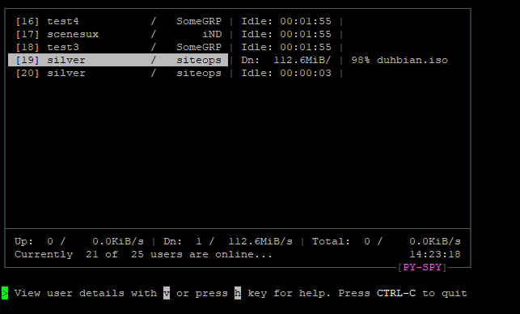
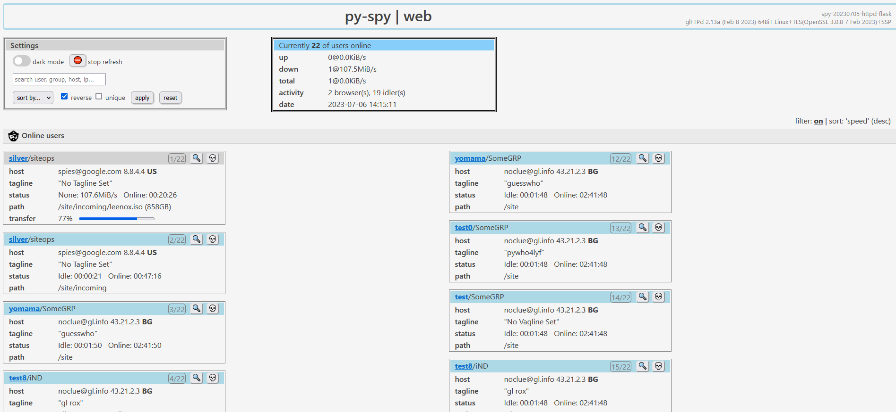

[](https://github.com/silv3rr/pyspy/actions/workflows/build.yml)

# SPY.PY

## /spai.pai/

Shows users logged into glftpd either in a terminal window or as web page. Like 'gl_spy' and also simular to 'webspy' from foo-tools. Used to be included with [pywho](https://github.com/silv3rr/pywho) but is now its own separate thing.

_cli mode_

[](https://github.com/silv3rr/pyspy/blob/main/docs/demo.gif)

_web mode_



Here's some more [more screenshots](docs/Screenshots.md) and a quick [demo](docs/Demo.md) clip.

"But wait", ppl cry.. "why is this stupid python! It will be impossible for me to use". Well, there's convenient binaries available for you. No messing about with annoying things like special python version 3.12.3.4, modules and virtual env's. Just copy the binary and run `./spy`, done.

## Usage

Running `./spy` without args starts `--cli` mode (default)

``` bash
./spy --web     # web mode: run webspy using flask (css, templates & js)
./spy --httpd   # run basic webspy using built in httpd
```

## Installation

Only glftpd version 2.12+ is supported (other versions untested)

Pick one of these 3 setup methods

## binaries

No dependencies, just single a executable file available to [download](../../releases).

Supported: Debian 10, 11, 12 and Ubuntu 20.04, 22.04, 24.04, CentOS Stream, Almalinux 9.3, Rockylinux 9.3, Alpine

EOL: [CentOS 7](https://github.com/silv3rr/pyspy/releases/download/slv-pyspy-v20230708/pyspy-centos7-python3.6-x86_x64.tar.gz)

Get all files from [Releases](../../releases) tab. Click **Show all .. assets** link at the bottom.

_the '-web' version is build with 'webspy' dir in binary (`_WITH_BUNDLE`), it's used by [docker-glftpd](https://github.com/silv3rr/docker-glftpd)_

## apt

- `apt install python3-sysv-ipc`
- `apt install python3-geoip2 python3-flask`  (optional)
- `git clone` this repo and run script: `./pywho.py`

## venv/pip

``` bash
# Install py3/venv pkgs first, e.g. for debian/redhat:
apt install python3-pip python3-venv
yum install python3-pip python3-virtualenv

python3 -m venv venv
source venv/bin/activate
pip3 install sysv-ipc
pip3 install geoip2 flask  # optional
```

Now 'git clone' this repo and run `./spy.py`

_If you want to build sysv_ip from src, see [https://github.com/osvenskan/sysv_ip](https://github.com/osvenskan/sysv_ipc)_

## docker

Alternatively pyspy is also be part of [docker-glftpd](https://github.com/silv3rr/docker-glftpd)'s web interface which offers a complete gl install.

## Configuration

To set gl path, color and refresh for cli, web ip/port etc edit 'spy.conf'. By default, web mode uses 127.0.0.1:5000.

All options are explained at the bottom of conf. Make sure 'ipc_key' matches glftpd.

To change how flask webspy looks, edit webspy/static/style.css and html in webspy/templates dir.

## Build

To build the pyspy binary yourself you need PyInstaller. You probably want to setup and activate a virtual env first (see above) then `pip install sysv-ipc pyinstaller`.

Now clone this repo and run build.sh, optionally add one or more of these args:

`_WITH_GEOIP _WITH_HTTPD _WITH_FLASK`

The build script will check and warn about wrong python version and missing modules.

## Build in docker

Same as github actions (CI), but build in local container.

`USAGE: ./docker-run-build.sh <ubuntu|debian|centos-stream|alma|rocky|alpine>`

## Issues

- If geoip2 is enabled you can run out of your free geoip queries
    - Max is 1000/day, ip lookups are cached in mem only and reset on restart of pyspy

- "CLI mode sucks! it doesnt work, updates slowly, ignores key presses, text gets fucked up"
    - Well, yeah, it uses simple ansi escape sequences and select() stdin instead of curses and input events etc..
