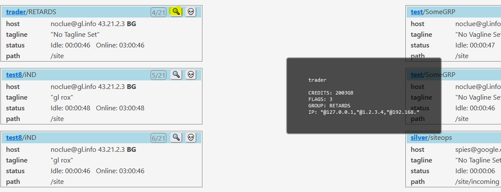

# Web

Starting web mode:

``` bash
(pyspy/venv) me@host:~/pyspy$ ./spy --web
 * Serving Flask app 'spy'
 * Debug mode: off
WARNING: This is a development server. Do not use it in a production deployment. Use a production WSGI server instead.
 * Running on http://127.0.0.1:5000
Press CTRL+C to quit
127.0.0.1 - - [06/Jul/2023 14:31:21] "GET /users?search=&sort_attr=speed&sort_rev=True HTTP/1.1" 200 -
127.0.0.1 - - [06/Jul/2023 14:31:21] "GET /totals HTTP/1.1" 200 -
```

Show user details:



# CLI

User info screen:

```python
┌───────────────────────────────────────────────────────────────────────┐
│ Login                                                                 │
│                                                                       │
│     Username: 'silver' [0/20]                                         │
│     PID: 665225 SSL: None                                             │
│     RHost: spies@google.com                                           │
│     IP: 8.8.4.4 US                                                    │
│     Tagline: No Tagline Set                                           │
│     Currentdir: /site/incoming                                        │
│     Status: PWD                                                       │
│     Last DL: 0.0GB                                                    │
│                                                                       │
├───────────────────────────────────────────────────────────────────────┤
│ Userfile                                                              │
│                                                                       │
│     FLAGS: ['134ABCDEFGHI']                                           │
│     CREDITS: 944GB                                                    │
│     GROUP: ['siteops', 'glftpd', 'CoolGroup']                         │
│     IP: ['*@127.0.0.1', '*@192.168.0.0/16', 'cenobite@1.30.156.* ...  │
│                                                                       │
└────────────────────────────────────────────────────────────[PY-SPY]───┘

> Press n for next login, p previous, k kill or ESC to go back.

```
